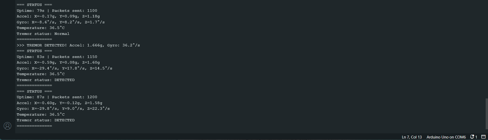
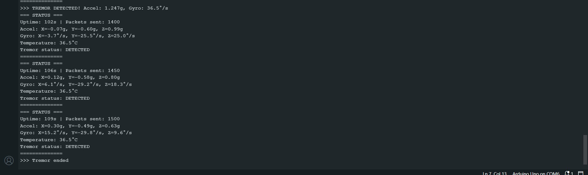
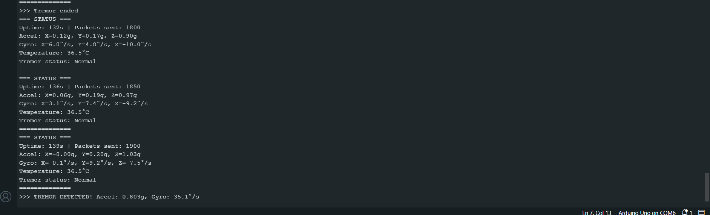

# Parkinson’s Tremor Detection System

## Project Overview
The Parkinson’s Tremor Detection System is designed to detect hand tremors associated with Parkinson’s disease using an MPU6050 accelerometer and gyroscope interfaced with an Arduino Nano. Tremor data is transmitted via Bluetooth to a monitoring device.

This project simulates tremor patterns using sine waves for demonstration purposes, allowing the system to be tested even without the hardware.

## Motivation
Parkinson’s disease affects millions worldwide, and early detection of tremors is crucial for timely intervention. This project aims to provide a low-cost, real-time tremor monitoring system that can assist doctors and patients in tracking hand tremor intensity and frequency.

## System Architecture
- **MPU6050 Sensor:** Measures acceleration and angular velocity along X, Y, Z axes.  
- **Arduino Nano:** Processes sensor data, applies calibration, filters noise, and detects tremor events.  
- **HC-05 Bluetooth Module:** Sends tremor data to external devices in real time.  
- **Simulation Mode:** Generates tremor and normal conditions using sine wave patterns.  

**Flow Diagram:**  
MPU6050 → Arduino Nano → Tremor Detection Algorithm → HC-05 Bluetooth → Monitoring Device

## Hardware Components
- Arduino Nano  
- MPU6050 (Accelerometer + Gyroscope)  
- HC-05 Bluetooth Module  
- Connecting wires  
- USB Cable  

## Software Implementation
- **Platform:** Arduino IDE  
- **Libraries:** Wire, SoftwareSerial  

### Key Algorithms
- Tremor detection based on acceleration and gyroscope thresholds  
- Noise filtering using low-pass filter  
- Detection of tremor onset and tremor end  
- Simulation Mode: Generates tremor signals with configurable frequency and amplitude  

## Features
- Real-time tremor detection  
- Bluetooth data transmission  
- Adjustable thresholds for tremor sensitivity  
- Simulation mode for testing without hardware  
- Continuous monitoring with packet reporting  

## Output Demonstration

### Tremor Detected
  
  

### Normal Condition

## Future Scope
- Integration with mobile or web apps for remote monitoring  
- Adding machine learning models for more accurate tremor classification  
- Storing historical data for trend analysis and patient reports  

## How to Run
1. Install Arduino IDE and required libraries: `Wire`, `SoftwareSerial`.  
2. Connect Arduino Nano to PC.  
3. Upload `ParkinsonTremorDetection.ino` to Arduino.  
4. Open Serial Monitor at 9600 baud.  
5. Observe tremor detection in both simulated and real modes.  
6. *(Optional)* Connect Bluetooth module to send data to a PC/mobile device.  

## Acknowledgements
- Inspired by real-time tremor monitoring research  
- MPU6050 sensor documentation and Arduino community  
- Open-source projects on Arduino-based health monitoring